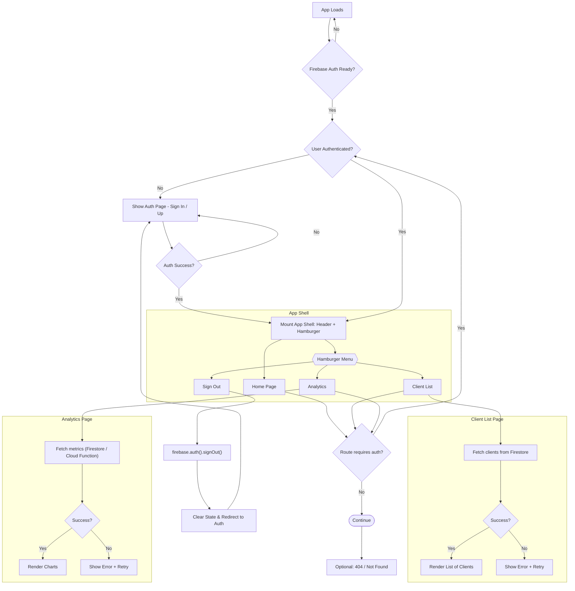

# Budget-Tracker
An all-in-one budget &amp; expense tracking app. 

## Running the application

```
cd opus-frontend
npm install
npm run dev
```

Uses Shadcn React components. See the documentation [here](https://ui.shadcn.com/docs/installation/vite).

To add a Shadcn component, run:
```
npx shadcn@latest add card
```

## Dependencies
firebase



